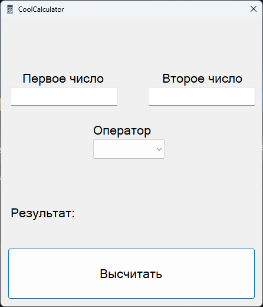
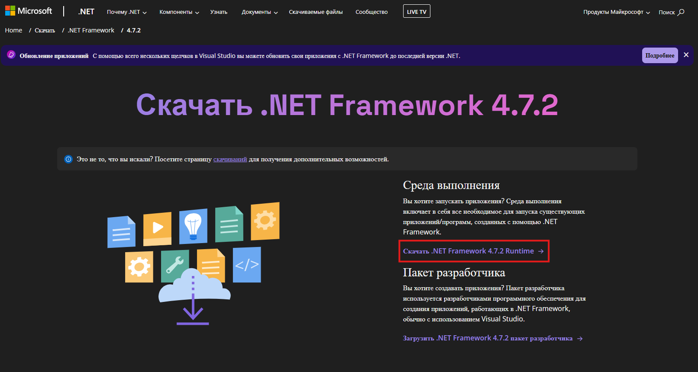
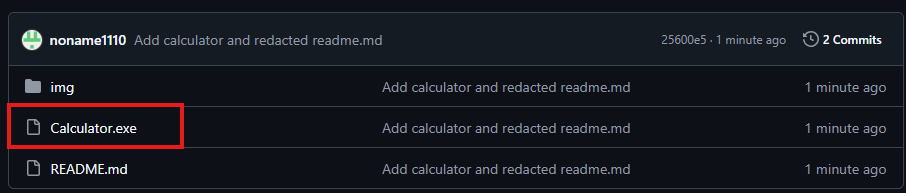
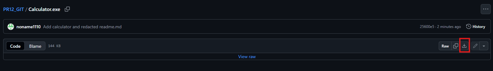
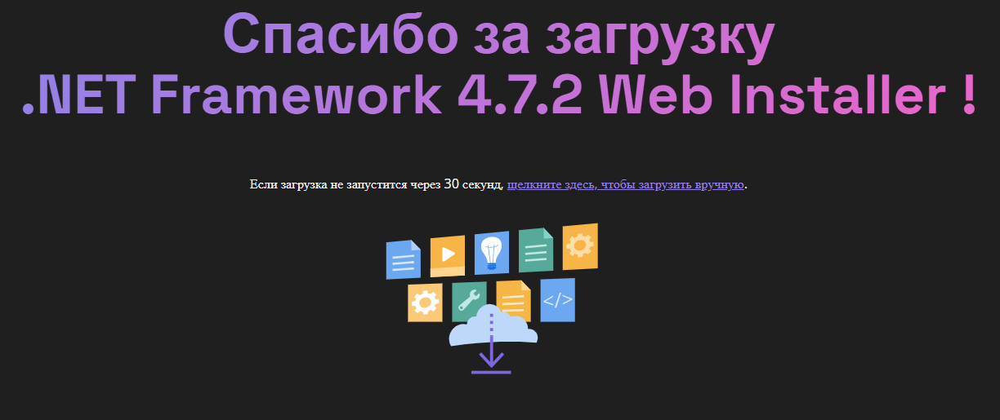
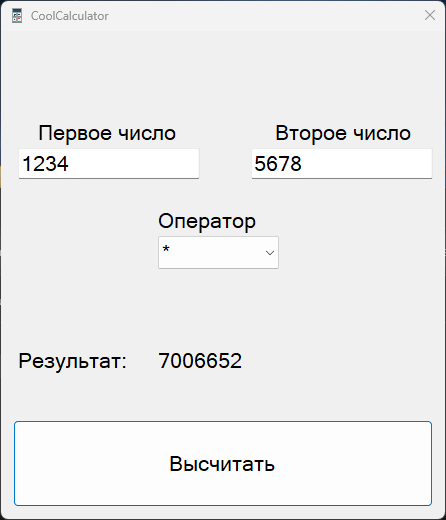

# Калькулятор с графическим интерфейсом на C#



## Описание

***Написал калькулятор студент группы ИС-23Б Яруничев А.Р.***

Приложение представляет собой *калькулятор*, с четярьмя операторами: "+", "-", "/", "*". Написан он на языке **C# на windows form**.

*Пример кода, запрет ввода всех символов, кроме цифр*
```Csharp
private void textBox_KeyPress(object sender, KeyPressEventArgs e)
{
    if (!char.IsControl(e.KeyChar) && !char.IsDigit(e.KeyChar))
    {
        e.Handled = true;
    }
}
```

### Установка и запуск

> [!IMPORTANT]
> Важно! Калькулятор работает только на ОС Windows не ниже 7!

1. Скачать Calculator.exe
2. Скачать и установить среду для выполнения .net franework 4.7.2
3. Запустите калькулятор
4. ~~Желание запустить калькулятор~~

|Необходимое ПО|Ссылка|
|---|---|
|.NET Framework 4.7.2 Runtime|[Скачать](https://dotnet.microsoft.com/ru-ru/download/dotnet-framework/net472)|

> [!IMPORTANT]
> Скачивайте именно runtime!



### Пошаговая инструкция

~~***для самых маленьких*** :grin:~~

**Шаг №1**\
Скачайте калькулятор с репозитория.



**Шаг №2**\
Скачайте по ссылке выше .net framework 4.7.2 и установите.


**Шаг №3**\
Запустите калькулятор и вычисляйте на здоровье! :smiley:


### Полезная информация
Для связи со мной пишите на почту: CoolPochta@outlook.com